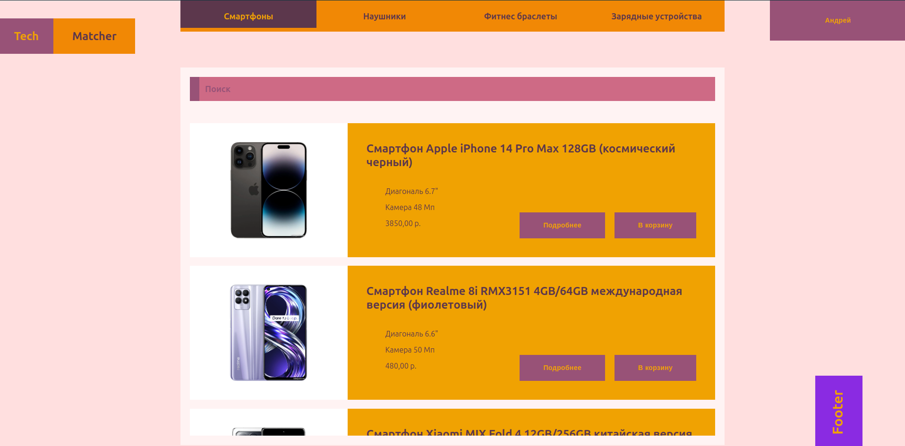

<h1 align="center">Hi there, I'm <a href="https://github.com/Na1x-dev" target="_blank">Andrey</a> 
</h1>
<h3 align="center">Backend developer from Belarus</h3>

<p>Here is my project which is written using Django Rest Framework and React.  This project was created as a service specializing in assistance in choosing a smartphone.</p>

## 📖 Description

TechMatcher offers an intuitive interface where users can:

- Select the appropriate equipment from the list using search and filters.
- Get a list of technologies and characteristics used in the devices.
- Place an order for the selected device.



## 🛠 Technologies

- **Backend:** Django is a powerful framework for developing web applications in Python.
- **Frontend:** React is a library for creating user interfaces.
- **Database:** PostgreSQL (or any other supported database).

## 📦 Installation

### Prerequisites

- Python 3.x
- Node.js
- PostgreSQL (or other database)

### Installation steps

1. Clone the repository:
```
bash:
   git clone https://github.com/Na1x-dev/TechMatcher
   cd TechMatcher
```

2. Install Django dependencies:
```
bash:
    cd backend
    pip install -r requirements.txt
```

3. Set up the database in settings.py and run migrations:
```
bash:
    python manage.py migrate
```
4. Run the Django server:
```
bash:
    python manage.py runserver
```

5. In a new terminal, install the dependencies for React:
```
bash:
    cd frontend
    npm install
```
6. Run the React app:
```
bash:
    npm start
```
You can now open your browser and navigate to http://localhost:3000 to see the app in action!

## 📫 Contact

If you have any questions or suggestions, you can contact us by email: na1x.1024@gmail.com.

Thank you for your interest in TechMatcher! We hope you find our app useful.