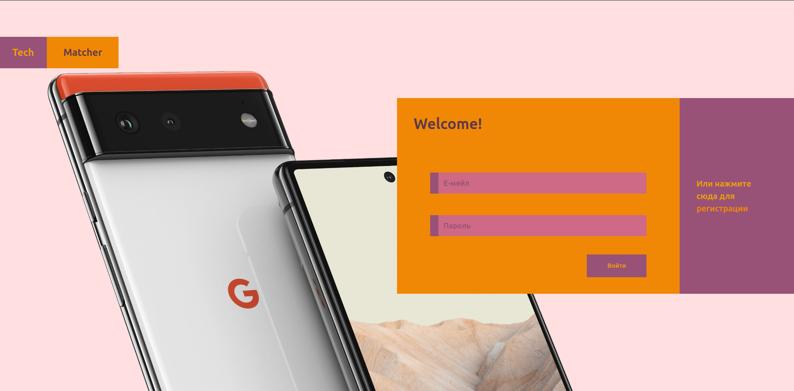
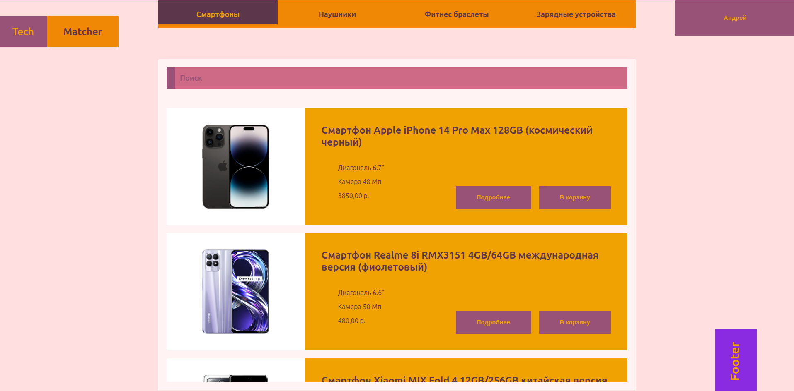
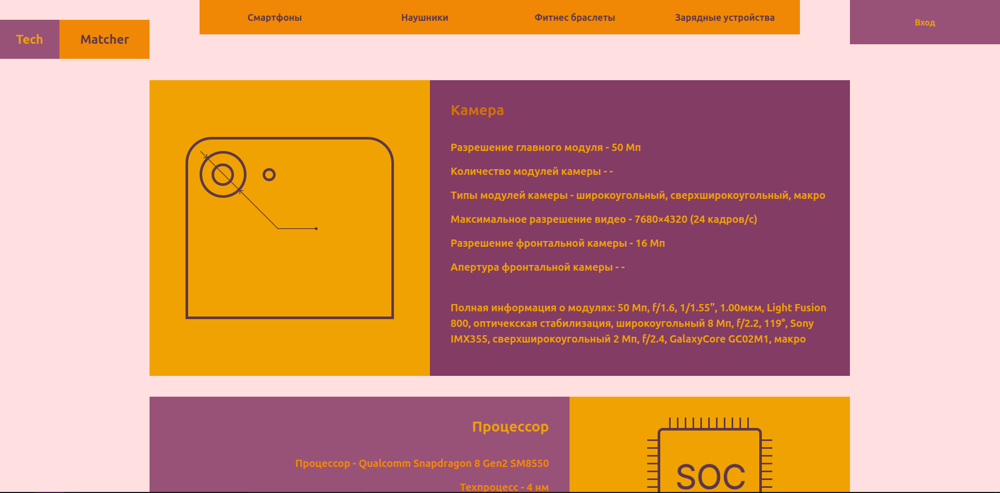

# 📱 TechMatcher — Smartphone Selection Service

An intuitive web service designed to help users select smartphones based on technical specifications. The project is a Fullstack application featuring a decoupled architecture with an independent REST API (Backend) and an interactive user interface (Frontend).

## 📖 Key Features

* 🔍 **Smart Search & Filtering:** Quick device selection based on core specifications and technologies.
* 📋 **Detailed Specifications:** Visual and structured display of technical parameters for each smartphone.
* 🛒 **Order Placement:** Ability to submit a purchase request for the selected device.
* 🤖 **Automated Parsing:** Built-in module (`parser/`) to gather up-to-date data about smartphones.

---

## 📸 Interface (Screenshots)

<div align="center">
   
  <p><i>Login screen of the application</i></p>
   
  
  <p><i>Main screen of the application and the device catalog</i></p>
   
   
  <p><i>Smartphone more details screen</i></p>
</div>

---

## 🛠️ Tech Stack

* **Backend:** Python, Django Rest Framework (DRF) — building the REST API architecture.
* **Frontend:** JavaScript, React — creating a dynamic and responsive user interface.
* **Database:** PostgreSQL (or any other compatible relational database).
* **Parser:** Python scripts for automated database population.

---

## 📦 Local Installation Guide

### Prerequisites
* Python 3.10+
* Node.js (v18+)
* PostgreSQL DBMS

### Step 1: Clone the Repository
```bash
git clone https://github.com/Na1x-dev/TechMatcher
cd TechMatcher
```

### Step 2: Backend Setup (Django DRF)
1. Navigate to the backend directory:
   ```bash
   cd back
   ```
2. Create and activate a virtual environment:
   ```bash
   python -m venv venv
   # For Windows:
   .\venv\Scripts\activate
   # For macOS/Linux:
   source venv/bin/activate
   ```
3. Install dependencies:
   ```bash
   pip install -r requirements.txt
   ```
4. Configure the database connection in `settings.py` (or via `.env`) and run migrations:
   ```bash
   python manage.py migrate
   ```
5. Start the local server:
   ```bash
   python manage.py runserver
   ```
   *The backend API will be available at `http://127.0.0`*

### Step 3: Frontend Setup (React)
1. Open a new terminal tab and navigate to the frontend folder from the project root:
   ```bash
   cd front
   ```
2. Install NPM packages:
   ```bash
   npm install
   ```
3. Start the client application:
   ```bash
   npm start
   # Or npm run dev (depending on your build tool)
   ```
   *The app will open at `http://localhost:3000/`*

---

## 📂 Project Structure
* `/back` — Server-side source code (Django applications, API endpoints, serializers).
* `/front` — Client-side code in React (components, styles, request logic).
* `/parser` — Parsing module for smartphone data gathering.
* `/md_imgs` — Static images for documentation.

---

## 📫 Contact
If you have any questions or suggestions for improving the project, feel free to contact me at: **na1x.1024@gmail.com**
